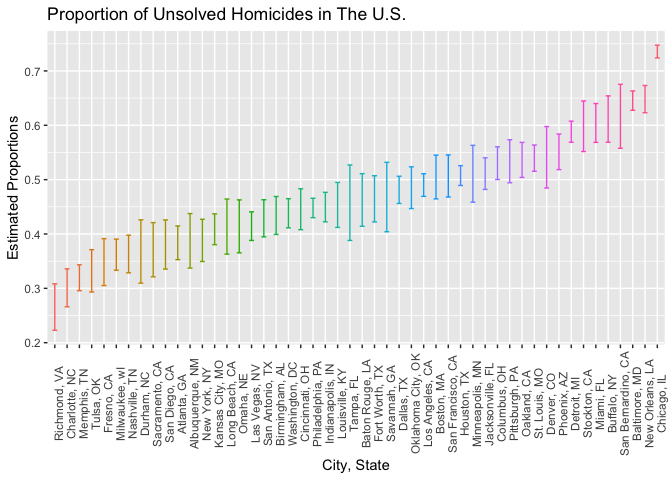

Homework 5
================

# Problem 1

``` r
list.files(path="./data", pattern=NULL, all.files=FALSE,
    full.names=FALSE)
```

    ##  [1] "con_01.csv" "con_02.csv" "con_03.csv" "con_04.csv" "con_05.csv"
    ##  [6] "con_06.csv" "con_07.csv" "con_08.csv" "con_09.csv" "con_10.csv"
    ## [11] "exp_01.csv" "exp_02.csv" "exp_03.csv" "exp_04.csv" "exp_05.csv"
    ## [16] "exp_06.csv" "exp_07.csv" "exp_08.csv" "exp_09.csv" "exp_10.csv"

# Problem 2

### Raw Dataset

``` r
urlfile="https://raw.githubusercontent.com/washingtonpost/data-homicides/master/homicide-data.csv"

post_homicide = read_csv(url(urlfile))
```

    ## Rows: 52179 Columns: 12
    ## ── Column specification ────────────────────────────────────────────────────────
    ## Delimiter: ","
    ## chr (9): uid, victim_last, victim_first, victim_race, victim_age, victim_sex...
    ## dbl (3): reported_date, lat, lon
    ## 
    ## ℹ Use `spec()` to retrieve the full column specification for this data.
    ## ℹ Specify the column types or set `show_col_types = FALSE` to quiet this message.

The raw dataset `post_homicide` includes 12 columns and 52179 rows. The
columns include reported date of homicide, location of the killing,
whether an arrest was made or not, and basic demographics about each
victim. Demographic information collected include the victims name, age,
race, and sex. Information collected about the location of the killing
include the city, state, and geographic coordinates (longitudinal and
latitudinal coordinates).

#### Creating `city_state` variable and summarizing total number of homicides and unsolved homicides

``` r
post_homicide =
  post_homicide %>% 
  mutate(city_state = paste(city, state, sep=", "))

total_homicides = post_homicide %>% 
  group_by(city_state) %>% 
  summarize(
        total_homicides = n())

unsolved_homicides = post_homicide %>% 
  group_by(city_state) %>% 
  filter(disposition %in% c("Closed without arrest", "Open/No arrest")) %>% 
  summarize(
    unsolved_homicides = n())

output = merge(total_homicides,unsolved_homicides,by=c("city_state"))
knitr::kable(output, col.names = c("City, State", "Total Homicides", "Unsolved Homicides"))
```

| City, State        | Total Homicides | Unsolved Homicides |
|:-------------------|----------------:|-------------------:|
| Albuquerque, NM    |             378 |                146 |
| Atlanta, GA        |             973 |                373 |
| Baltimore, MD      |            2827 |               1825 |
| Baton Rouge, LA    |             424 |                196 |
| Birmingham, AL     |             800 |                347 |
| Boston, MA         |             614 |                310 |
| Buffalo, NY        |             521 |                319 |
| Charlotte, NC      |             687 |                206 |
| Chicago, IL        |            5535 |               4073 |
| Cincinnati, OH     |             694 |                309 |
| Columbus, OH       |            1084 |                575 |
| Dallas, TX         |            1567 |                754 |
| Denver, CO         |             312 |                169 |
| Detroit, MI        |            2519 |               1482 |
| Durham, NC         |             276 |                101 |
| Fort Worth, TX     |             549 |                255 |
| Fresno, CA         |             487 |                169 |
| Houston, TX        |            2942 |               1493 |
| Indianapolis, IN   |            1322 |                594 |
| Jacksonville, FL   |            1168 |                597 |
| Kansas City, MO    |            1190 |                486 |
| Las Vegas, NV      |            1381 |                572 |
| Long Beach, CA     |             378 |                156 |
| Los Angeles, CA    |            2257 |               1106 |
| Louisville, KY     |             576 |                261 |
| Memphis, TN        |            1514 |                483 |
| Miami, FL          |             744 |                450 |
| Milwaukee, wI      |            1115 |                403 |
| Minneapolis, MN    |             366 |                187 |
| Nashville, TN      |             767 |                278 |
| New Orleans, LA    |            1434 |                930 |
| New York, NY       |             627 |                243 |
| Oakland, CA        |             947 |                508 |
| Oklahoma City, OK  |             672 |                326 |
| Omaha, NE          |             409 |                169 |
| Philadelphia, PA   |            3037 |               1360 |
| Phoenix, AZ        |             914 |                504 |
| Pittsburgh, PA     |             631 |                337 |
| Richmond, VA       |             429 |                113 |
| Sacramento, CA     |             376 |                139 |
| San Antonio, TX    |             833 |                357 |
| San Bernardino, CA |             275 |                170 |
| San Diego, CA      |             461 |                175 |
| San Francisco, CA  |             663 |                336 |
| Savannah, GA       |             246 |                115 |
| St. Louis, MO      |            1677 |                905 |
| Stockton, CA       |             444 |                266 |
| Tampa, FL          |             208 |                 95 |
| Tulsa, OK          |             583 |                193 |
| Washington, DC     |            1345 |                589 |

#### `prop.test` of Baltimore,MD

``` r
baltimore_post = 
  prop.test(x=1825, n=2827, p = NULL, alternative = "two.sided", conf.level = 0.95, correct = TRUE) %>% 
  tidy() %>% 
  select(estimate, conf.low, conf.high)

knitr::kable(baltimore_post, digits = 3)
```

| estimate | conf.low | conf.high |
|---------:|---------:|----------:|
|    0.646 |    0.628 |     0.663 |

#### `prop.test` for each city in the dataset

``` r
each_city = output %>% 
  mutate(
    result = map2(output$unsolved_homicides, output$total_homicides, prop.test),
    result = map(result, tidy),
    result = map(result, ~select(.x, estimate, conf.low, conf.high))) %>% 
  unnest(cols = c(result))

knitr::kable(each_city, digits = 3)
```

| city_state         | total_homicides | unsolved_homicides | estimate | conf.low | conf.high |
|:-------------------|----------------:|-------------------:|---------:|---------:|----------:|
| Albuquerque, NM    |             378 |                146 |    0.386 |    0.337 |     0.438 |
| Atlanta, GA        |             973 |                373 |    0.383 |    0.353 |     0.415 |
| Baltimore, MD      |            2827 |               1825 |    0.646 |    0.628 |     0.663 |
| Baton Rouge, LA    |             424 |                196 |    0.462 |    0.414 |     0.511 |
| Birmingham, AL     |             800 |                347 |    0.434 |    0.399 |     0.469 |
| Boston, MA         |             614 |                310 |    0.505 |    0.465 |     0.545 |
| Buffalo, NY        |             521 |                319 |    0.612 |    0.569 |     0.654 |
| Charlotte, NC      |             687 |                206 |    0.300 |    0.266 |     0.336 |
| Chicago, IL        |            5535 |               4073 |    0.736 |    0.724 |     0.747 |
| Cincinnati, OH     |             694 |                309 |    0.445 |    0.408 |     0.483 |
| Columbus, OH       |            1084 |                575 |    0.530 |    0.500 |     0.560 |
| Dallas, TX         |            1567 |                754 |    0.481 |    0.456 |     0.506 |
| Denver, CO         |             312 |                169 |    0.542 |    0.485 |     0.598 |
| Detroit, MI        |            2519 |               1482 |    0.588 |    0.569 |     0.608 |
| Durham, NC         |             276 |                101 |    0.366 |    0.310 |     0.426 |
| Fort Worth, TX     |             549 |                255 |    0.464 |    0.422 |     0.507 |
| Fresno, CA         |             487 |                169 |    0.347 |    0.305 |     0.391 |
| Houston, TX        |            2942 |               1493 |    0.507 |    0.489 |     0.526 |
| Indianapolis, IN   |            1322 |                594 |    0.449 |    0.422 |     0.477 |
| Jacksonville, FL   |            1168 |                597 |    0.511 |    0.482 |     0.540 |
| Kansas City, MO    |            1190 |                486 |    0.408 |    0.380 |     0.437 |
| Las Vegas, NV      |            1381 |                572 |    0.414 |    0.388 |     0.441 |
| Long Beach, CA     |             378 |                156 |    0.413 |    0.363 |     0.464 |
| Los Angeles, CA    |            2257 |               1106 |    0.490 |    0.469 |     0.511 |
| Louisville, KY     |             576 |                261 |    0.453 |    0.412 |     0.495 |
| Memphis, TN        |            1514 |                483 |    0.319 |    0.296 |     0.343 |
| Miami, FL          |             744 |                450 |    0.605 |    0.569 |     0.640 |
| Milwaukee, wI      |            1115 |                403 |    0.361 |    0.333 |     0.391 |
| Minneapolis, MN    |             366 |                187 |    0.511 |    0.459 |     0.563 |
| Nashville, TN      |             767 |                278 |    0.362 |    0.329 |     0.398 |
| New Orleans, LA    |            1434 |                930 |    0.649 |    0.623 |     0.673 |
| New York, NY       |             627 |                243 |    0.388 |    0.349 |     0.427 |
| Oakland, CA        |             947 |                508 |    0.536 |    0.504 |     0.569 |
| Oklahoma City, OK  |             672 |                326 |    0.485 |    0.447 |     0.524 |
| Omaha, NE          |             409 |                169 |    0.413 |    0.365 |     0.463 |
| Philadelphia, PA   |            3037 |               1360 |    0.448 |    0.430 |     0.466 |
| Phoenix, AZ        |             914 |                504 |    0.551 |    0.518 |     0.584 |
| Pittsburgh, PA     |             631 |                337 |    0.534 |    0.494 |     0.573 |
| Richmond, VA       |             429 |                113 |    0.263 |    0.223 |     0.308 |
| Sacramento, CA     |             376 |                139 |    0.370 |    0.321 |     0.421 |
| San Antonio, TX    |             833 |                357 |    0.429 |    0.395 |     0.463 |
| San Bernardino, CA |             275 |                170 |    0.618 |    0.558 |     0.675 |
| San Diego, CA      |             461 |                175 |    0.380 |    0.335 |     0.426 |
| San Francisco, CA  |             663 |                336 |    0.507 |    0.468 |     0.545 |
| Savannah, GA       |             246 |                115 |    0.467 |    0.404 |     0.532 |
| St. Louis, MO      |            1677 |                905 |    0.540 |    0.515 |     0.564 |
| Stockton, CA       |             444 |                266 |    0.599 |    0.552 |     0.645 |
| Tampa, FL          |             208 |                 95 |    0.457 |    0.388 |     0.527 |
| Tulsa, OK          |             583 |                193 |    0.331 |    0.293 |     0.371 |
| Washington, DC     |            1345 |                589 |    0.438 |    0.411 |     0.465 |

#### Plot that shows the estimates and CIs for each city

``` r
each_city %>% 
  mutate(city_state = fct_reorder(city_state, estimate)) %>% 
  ggplot(aes(x = city_state, y = estimate, color = city_state)) +
  geom_errorbar(aes(ymin = conf.low, ymax = conf.high), width = 0.4) +
  theme(legend.position = "none", axis.text.x = element_text(angle = 90)) +
  labs(
    title = "Proportion of Unsolved Homicides in The U.S.",
    x = "City, State",
    y = "Estimated Proportions"
  )
```

<!-- -->

# Problem 3

``` r
set.seed(1)

new_datasets = map(1:5000, ~ rnorm(n = 30, mean = 0, sd = 5))

ttest_datasets = 
  map(new_datasets, t.test) %>% 
  map(tidy) %>% 
  map(~select(.x, estimate, p.value)) %>%
  as.data.frame() %>%
  pivot_longer(cols = everything(),
               names_to = "parameter",
               values_to = "values") 
    
ttest_datasets[2, "parameter"] <- "p.value.0"
ttest_datasets[1, "parameter"] <- "estimate.0"

ttest_datasets
```

    ## # A tibble: 10,000 × 2
    ##    parameter   values
    ##    <chr>        <dbl>
    ##  1 estimate.0  0.412 
    ##  2 p.value.0   0.629 
    ##  3 estimate.1  0.664 
    ##  4 p.value.1   0.368 
    ##  5 estimate.2  0.551 
    ##  6 p.value.2   0.534 
    ##  7 estimate.3  0.567 
    ##  8 p.value.3   0.487 
    ##  9 estimate.4 -1.65  
    ## 10 p.value.4   0.0599
    ## # … with 9,990 more rows

``` r
repeated_output = 
  
  for (i in 1:6) {
    
    [[i]] = 
  }
```
